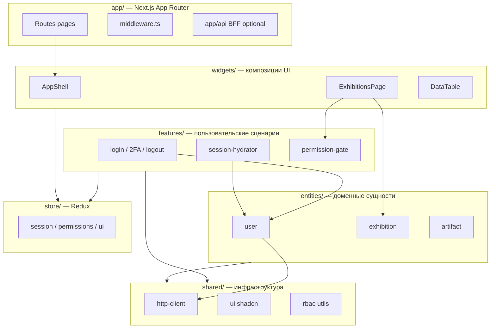
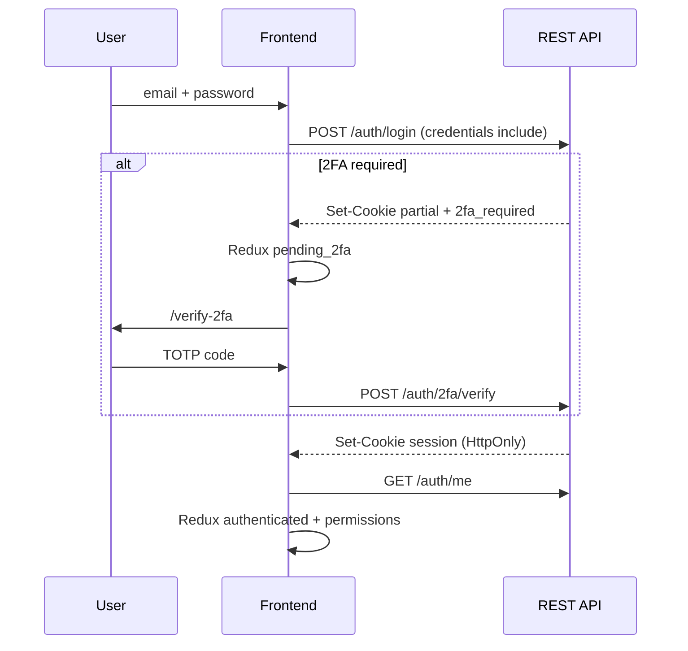

# Muzeon Admin — Frontend Architecture

> Production-grade архитектура административной панели управления контентом музея.  
> Стек: **Next.js 15 (App Router)**, **React 19**, **TypeScript strict**, **Tailwind + shadcn/ui**, **TanStack Query**, **RHF + Zod**, **TanStack Table v8**, **Redux Toolkit**.

---

## 1. Резюме и ключевые решения

| Решение | Выбор | Почему (2026) |
|--------|--------|----------------|
| Структура кода | **Feature-Sliced Design (FSD) lite** + тонкий App Router | Масштабируется на десятки доменов (выставки, экспонаты, медиа, пользователи) без «большого комка» в `components/` |
| Маршрутизация | **Route Groups** `(auth)` / `(dashboard)` | Изоляция layout’ов, middleware, SEO-метаданных |
| Server vs Client | **RSC для страниц-оболочек**, **Client для интерактива** | App Router по умолчанию — Server Components; формы, таблицы, Redux — `'use client'` |
| Серверное состояние | **TanStack Query v5** | Кэш REST, инвалидация, optimistic updates, devtools — стандарт для API-driven SPA |
| Клиентское состояние | **Redux Toolkit** | Сессия, RBAC, UI shell — синхронный глобальный доступ без prop drilling |
| Формы | **React Hook Form + Zod** | Производительность + единые схемы для форм и API-контрактов |
| Таблицы | **TanStack Table v8** в `widgets/data-table` | Headless — полный контроль UI (shadcn) и server-side pagination позже |
| Авторизация | **HTTP-only cookies** + **2FA** | Безопасное хранение токена; `credentials: 'include'` на всех запросах |
| RBAC | **Permission strings** `resource:action` + `PermissionGate` | Backend — source of truth; фронт только скрывает UI (не заменяет проверку на API) |
| API | Прямой **REST** с опциональным **BFF** в `app/api` | Для cookie/proxy/CORS при необходимости |

**Не используем:** RTK Query (дублирует TanStack Query), глобальный Zustand для server state, Pages Router, barrel-файлы на каждом уровне (tree-shaking 2026 — явные импорты).

---

## 2. Диаграмма слоёв



**Правило зависимостей (строго сверху вниз):**

```
app → widgets → features → entities → shared
store ← features, widgets (hooks)
```

Запрещено: `entities` импортирует `features`, `shared` импортирует `entities`.

---

## 3. Дерево проекта

```
muzeon-admin/
├── architecture.md          # этот документ
├── package.json
├── tsconfig.json              # strict + path aliases
├── next.config.ts
├── .env.example
│
└── src/
    ├── middleware.ts          # cookie gate (не полная авторизация)
    │
    ├── app/                   # ТОЛЬКО маршруты и layouts (тонкий слой)
    │   ├── layout.tsx
    │   ├── providers.tsx      # Redux + QueryClient
    │   ├── globals.css
    │   ├── (auth)/
    │   │   ├── layout.tsx
    │   │   ├── login/page.tsx
    │   │   └── verify-2fa/page.tsx
    │   ├── (dashboard)/
    │   │   ├── layout.tsx     # AppShell + SessionHydrator
    │   │   ├── page.tsx
    │   │   ├── exhibitions/
    │   │   │   ├── page.tsx
    │   │   │   └── [id]/page.tsx
    │   │   ├── artifacts/page.tsx
    │   │   └── users/page.tsx
    │   └── api/
    │       └── health/route.ts
    │
    ├── store/                 # Redux Toolkit
    │   ├── index.ts
    │   ├── root-reducer.ts
    │   ├── hooks.ts           # typed useAppDispatch / useAppSelector
    │   └── slices/
    │       ├── session-slice.ts
    │       ├── permissions-slice.ts
    │       └── ui-slice.ts
    │
    ├── entities/              # Домен: модель + API + query keys
    │   ├── user/
    │   │   ├── model/types.ts
    │   │   └── api/{user-api,query-keys}.ts
    │   ├── exhibition/
    │   │   ├── model/{types,schemas}.ts
    │   │   └── api/{exhibition-api,query-keys}.ts
    │   └── artifact/
    │       ├── model/types.ts
    │       └── api/{artifact-api,query-keys}.ts
    │
    ├── features/              # Сценарии (одна папка = одно действие)
    │   ├── auth/
    │   │   ├── login/{api,model,ui}
    │   │   ├── verify-2fa/{api,model,ui}
    │   │   ├── logout/{api,ui}
    │   │   └── session-hydrator/ui
    │   └── rbac/
    │       └── permission-gate/ui
    │
    ├── widgets/               # Страницы и крупные блоки UI
    │   ├── app-shell/
    │   ├── sidebar/
    │   ├── header/
    │   ├── data-table/        # обёртка TanStack Table
    │   ├── exhibitions-page/
    │   ├── exhibition-detail-page/
    │   ├── artifacts-page/
    │   └── users-page/
    │
    └── shared/
        ├── api/
        │   ├── http-client.ts   # fetch + credentials + ApiError
        │   ├── query-client.ts
        │   └── types.ts
        ├── config/env.ts        # Zod-валидация env
        ├── lib/
        │   ├── utils.ts         # cn()
        │   └── rbac/{types,can}.ts
        └── ui/                  # shadcn primitives
            ├── button.tsx
            ├── input.tsx
            └── label.tsx
```

### 3.1. Сегменты внутри слайса (FSD)

Каждый модуль в `entities/*`, `features/*`, `widgets/*` повторяет структуру:

| Сегмент | Назначение |
|---------|------------|
| `model/` | TypeScript-типы, Zod-схемы, константы домена |
| `api/` | Вызовы REST, query keys (для TanStack Query) |
| `ui/` | React-компоненты (`'use client'` где нужно) |
| `lib/` | (опционально) чистые хелперы слайса |

**Новая сущность (например, `media`):**

1. `entities/media/model/types.ts`
2. `entities/media/api/media-api.ts` + `query-keys.ts`
3. `widgets/media-page/ui/...`
4. `app/(dashboard)/media/page.tsx` — одна строка импорта виджета

---

## 4. Разделение состояния: Redux vs TanStack Query

### 4.1. TanStack Query — **server state**

- Списки и детали: выставки, экспонаты, пользователи
- Ответы `/auth/me` при гидратации (кэш + повторное использование)
- Мутации: create/update/delete с `onSuccess` → `queryClient.invalidateQueries`

**Query keys** живут рядом с entity: `entities/exhibition/api/query-keys.ts`

```ts
exhibitionQueryKeys.detail(id)  // ['exhibitions', 'detail', id]
```

### 4.2. Redux — **client / session state**

| Slice | Содержимое | Причина Redux |
|-------|------------|---------------|
| `session` | `user`, `status` (idle, loading, authenticated, pending_2fa) | Доступ из sidebar, header, gates без Context |
| `permissions` | `granted: Permission[]` | Синхронные проверки RBAC в навигации |
| `ui` | `sidebarCollapsed` | Персистентность UI (опционально `redux-persist` позже) |

**Не кладём в Redux:** списки сущностей, пагинация таблиц, черновики форм.

---

## 5. Авторизация: cookies + 2FA

### 5.1. Поток



### 5.2. Слои защиты

1. **`middleware.ts`** — проверяет **наличие** cookie `session` (имя согласовать с backend). Редирект на `/login?redirect=...`. Не парсит JWT — только edge gate.
2. **`SessionHydrator`** (dashboard layout) — `GET /auth/me`, заполняет Redux, обрабатывает 401.
3. **Backend** — единственный источник истины; фронт не хранит access token в `localStorage`.

### 5.3. HTTP-клиент

`shared/api/http-client.ts`:

- `credentials: 'include'` на каждом запросе
- Единый `ApiError` с `status` и телом ошибки
- Zod-валидация ответов — добавлять по мере стабилизации контрактов API

### 5.4. Logout

`POST /auth/logout` → очистка cookie на сервере → `sessionActions.clearSession()` → `queryClient.clear()` → `/login`.

---

## 6. RBAC и роли

### 6.1. Модель

- **Роли** (`Role`): строковый slug с backend, например `content_manager`, `admin`.
- **Права** (`Permission`): формат `resource:action`, например `exhibitions:write`, `users:manage`.

Пользователь приходит с `/auth/me`:

```ts
type User = {
  id: string;
  email: string;
  displayName: string;
  roles: Role[];
  // permissions — отдельным полем или через role mapping на backend
};
```

### 6.2. Проверки на фронте

- `shared/lib/rbac/can.ts` — `can`, `canAny`, `canAll`
- `features/rbac/permission-gate` — декларативное скрытие кнопок/пунктов меню
- `store/slices/permissions-slice` — кэш прав для быстрого доступа

**Важно:** скрытый UI ≠ разрешённое действие. API всегда возвращает 403.

### 6.3. Расширение (когда появится контекст ролей)

1. Зафиксировать enum/union ролей в `shared/lib/rbac/roles.ts`
2. Матрицу прав — в `shared/lib/rbac/permission-matrix.ts` (только для dev/fallback; prod — с API)
3. HOC или hook `usePermission()` в `shared/hooks/`
4. Опционально: [@casl/ability](https://casl.js.org/) при сложных условиях (поле + владелец записи)

---

## 7. Интеграция с REST API

### 7.1. Конвенции

| Аспект | Рекомендация |
|--------|----------------|
| Base URL | `NEXT_PUBLIC_API_BASE_URL` (клиент), `API_BASE_URL` (сервер/BFF) |
| Версия | `/v1` в base URL |
| Ошибки | `{ message, code?, details? }` → `ApiError` |
| Пагинация | `{ data, meta: { page, perPage, total, totalPages } }` |
| Фильтры | query params, отражены в query keys |

### 7.2. Entity API pattern

```ts
// entities/exhibition/api/exhibition-api.ts
export const exhibitionApi = {
  list: (params) => httpClient<PaginatedResponse<Exhibition>>('/exhibitions', { params }),
  byId: (id) => httpClient<Exhibition>(`/exhibitions/${id}`),
  create: (body) => httpClient<Exhibition>('/exhibitions', { method: 'POST', body }),
};
```

### 7.3. BFF (Route Handlers) — когда нужен

Добавлять `src/app/api/proxy/[...path]/route.ts` если:

- CORS не настроен на API и нужен same-origin proxy
- Нужно прокидывать cookies server-side к internal API
- Скрыть internal URL от браузера

По умолчанию — **прямые запросы** с `credentials: 'include'` (проще, меньше latency).

---

## 8. Next.js App Router — практики

### 8.1. Route Groups

- `(auth)` — без AppShell, центрированные формы
- `(dashboard)` — защищённая зона с `SessionHydrator` + `AppShell`

### 8.2. Страницы остаются тонкими

```tsx
// app/(dashboard)/exhibitions/page.tsx
import { ExhibitionsPage } from '@/widgets/exhibitions-page/ui/exhibitions-page';
export default function Page() {
  return <ExhibitionsPage />;
}
```

### 8.3. Server Components

- `page.tsx` может быть `async` и передавать `params` / `searchParams` в виджеты
- Не импортировать Redux/React Query в Server Components
- Префетч данных (опционально): `queryClient.prefetchQuery` в Server Component + `HydrationBoundary` — при необходимости SEO/TTI

### 8.4. Providers

`app/providers.tsx` — client boundary:

- `ReduxProvider`
- `QueryClientProvider` (один instance на вкладку через `useState`)

---

## 9. Формы и валидация

| Слой | Инструмент |
|------|------------|
| Форма UI | React Hook Form |
| Валидация | Zod (`zodResolver`) |
| Схемы домена | `entities/*/model/schemas.ts` |
| Схемы сценария | `features/*/model/schemas.ts` |

Мутации форм — `useMutation` + инвалидация query keys entity.

Ошибки API `details` — маппинг на `setError` полей формы в `onError` мутации.

---

## 10. Таблицы (TanStack Table)

- Базовый компонент: `widgets/data-table/ui/data-table.tsx`
- Колонки объявляются в **виджете страницы** (бизнес-контекст)
- Следующие итерации:
  - `getSortedRowModel`, `getFilteredRowModel` — клиент
  - Server-side: `manualPagination`, `pageCount` из `meta.totalPages`
  - Вынести `widgets/data-table/lib/use-server-table.ts`

---

## 11. UI и дизайн-система

- **Tailwind CSS v4** + CSS variables в `globals.css`
- **shadcn/ui** — копируемые примитивы в `shared/ui/`
- `components.json` — конфиг CLI shadcn (`npx shadcn@latest add dialog table ...`)
- `cn()` — `shared/lib/utils.ts` (clsx + tailwind-merge)

**Токены:** не хардкодить цвета в виджетах — использовать semantic classes (`bg-muted`, `text-muted-foreground`).

---

## 12. TypeScript и алиасы

`tsconfig.json`:

- `strict: true`, `noUncheckedIndexedAccess: true`
- Path aliases: `@/entities/*`, `@/features/*`, `@/widgets/*`, `@/shared/*`, `@/store/*`

Импорты **глубокие** (явные файлы), не `entities/exhibition` barrel — лучше для tree-shaking и циклических зависимостей.

---

## 13. Обработка ошибок

| Уровень | Поведение |
|---------|-----------|
| `ApiError` 401 | SessionHydrator / interceptor → logout flow |
| `ApiError` 403 | Toast + сообщение «Недостаточно прав» |
| `ApiError` 422 | Маппинг на форму |
| 5xx | Toast + retry в Query |
| React error boundary | `app/global-error.tsx` (добавить при внедрении) |

Рекомендуется: единый `QueryCache` `onError` в `query-client.ts` для 401.

---

## 14. Тестирование (план для команды)

| Тип | Инструмент | Что тестировать |
|-----|------------|-----------------|
| Unit | Vitest | `rbac/can`, zod schemas, reducers |
| Component | RTL + MSW | forms login/2FA, PermissionGate |
| E2E | Playwright | auth flow, CRUD smoke |

MSW handlers зеркалят `entities/*/api/*`.

---

## 15. CI/CD и качество

```bash
npm run typecheck   # tsc --noEmit
npm run lint        # eslint
npm run build       # next build
```

- PR: typecheck + lint + build обязательны
- Preview deploy на каждый PR (Vercel / аналог)
- Env: `NEXT_PUBLIC_API_BASE_URL` per environment

---

## 16. Добавление нового домена — чеклист

1. [ ] `entities/<domain>/model/types.ts` + schemas
2. [ ] `entities/<domain>/api/<domain>-api.ts` + `query-keys.ts`
3. [ ] `widgets/<domain>-page/ui/...` (+ detail/edit features при необходимости)
4. [ ] `app/(dashboard)/<domain>/page.tsx`
5. [ ] Права в RBAC: `<domain>:read`, `<domain>:write`
6. [ ] Пункт в `widgets/sidebar` + `PermissionGate`
7. [ ] MSW + E2E сценарий

---

## 17. Антипаттерны (избегать)

- Бизнес-логика в `app/**/page.tsx` (кроме compose)
- Redux для кэша списков API
- `localStorage` для session/token
- Импорт `widgets` из `entities`
- Один каталог `components/` на весь проект без слоёв
- Дублирование fetch вне `httpClient`

---

## 18. Roadmap после MVP scaffold

1. OpenAPI → codegen types (`openapi-typescript`) + Zod `.parse()` на ответах
2. `global-error.tsx`, toast (sonner)
3. Server-side pagination в DataTable
4. `redux-persist` для UI preferences
5. i18n (`next-intl`) если потребуется EN
6. Storybook для `shared/ui` и `widgets/data-table`
7. Feature flags (Unleash / PostHog) для поэтапного rollout

---

## 19. Ссылки на ключевые файлы репозитория

| Назначение | Путь |
|------------|------|
| Edge auth gate | `src/middleware.ts` |
| Providers | `src/app/providers.tsx` |
| HTTP client | `src/shared/api/http-client.ts` |
| Session slice | `src/store/slices/session-slice.ts` |
| Login / 2FA | `src/features/auth/login`, `verify-2fa` |
| RBAC gate | `src/features/rbac/permission-gate` |
| Query keys pattern | `src/entities/exhibition/api/query-keys.ts` |
| Design tokens (CSS) | `src/app/globals.css` |
| UI Kit компоненты | `src/shared/ui/` |
| Статусы / типы контента | `src/entities/content/model/types.ts` |

---

## 20. Design System (UI Kit v1.0)

Проект визуально привязан к брендбуку **«Музейная платформа монетизации»**:

- Палитра: Primary `#3B82F6`, Success/Error/Warning по макету
- Стек UI: shadcn/ui + Tailwind v4 + Lucide
- Статусы: `draft` | `published` | `active` | `archived` → `StatusBadge`
- Типы контента: exhibition, lecture, workshop, event, excursion
- Таблица событий: колонки Название / Тип / Дата / Статус / Билеты / Доход

Подробности: **[design-system.md](./design-system.md)**.

---

*Документ версии 1.1 — добавлена Design System v1.0.*
